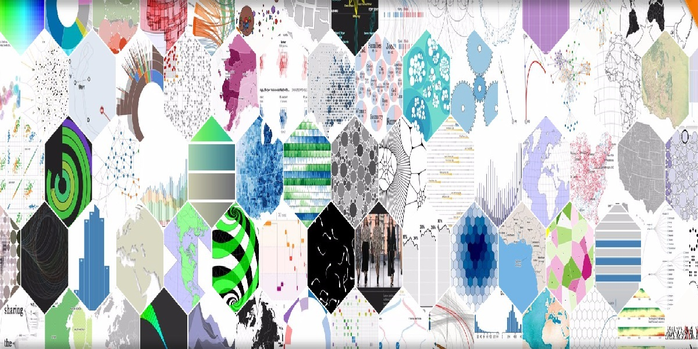

## D3 是什么
D3 的全称：Data-Driven Documents，被 *数据驱动* 的文档，其实就是用来做数据可视化的 JavaScript 库。

## 为什么需要学习使用 D3
首先 D3.js 是一个数据可视化 js 库，结合 HTML，SVG，CSS，canvas，D3 可以图形化的、生动的展现数据。目前有 *v3* 和 *v4* 两个版本，v3 是基于 SVG，v4 做了些性能上的提升，已经支持 canvas 了，这样也就减少了很多 DOM 操作。

在数据可视化方面，已经封装了许多可视化 API 方法，大大减少了开发者的工作量。同时，它也具有高定制性、代码简洁、有研究趣味的特点。

D3.js 目前托管于 [*GitHub*](https://github.com/d3/d3) ，star 量高达 71.4k(恐怖如斯)，赶快学习 D3 吧，学习还能使我快乐。

## 核心：数据驱动 (Data-Driven)
何谓数据驱动？


其旨在将数据与图形绑定，图形又等同于可视化元素，所以也可称作为将数据与可视化元素绑定。这里的可视化元素指的就是 HTML 标签、canvas 绘制的图形、SVG 的形状元素。

D3 通过 enter()、exit()、data()三个方法得到的数据集与选择元素 (selection) 绑定。
下面就来了解下这个机制（声明 DOM 对象集 => 声明数据集 => 比较获取缺失的 DOM 集 => 追加 DOM 对象并设置其属性）：
```js
d3.select('#chart')
  .selectAll('p')    // 得到可视化元素，返回一个 DOM 对象集，和 jQuery 选择器类似
  .data(data)      // 为选中的可视化元素绑定数据集, 必须传入数组
  .enter()    // 返回数据集比 DOM 集多出的数据，并得到数据集与可视化元素的对应关系
  .append('p') // 创建上一步缺失的 DOM 对象
  .text(d => d) // 设置 DOM 元素属性，如果传入的是一个函数，那么将遍历每个 enter 返回的数据集中的元素，并执行
  .attr('class', 'testClass') // 设置 DOM 元素属性
```
### exit() 和 enter() 讲解
例有如下 DOM 结构, 数据集 data 为 [1,2,3]：
``` html
<div id="chart">
  <p></p>
</div>
```
执行:
```js
d3.select('#chart')
  .selectAll('p')
  .data(data)
  .enter()
  .append('p')
  .text(d => d)
  .attr('class', 'enterClass');
```
代码之后，将会得到如下 DOM 结构：
``` html
<div id="chart">
  <p></p>
  <p class="enterClass">2</p>
  <p class="enterClass">3</p>
</div>
```
而执行:
```js
d3.select('#chart')
  .selectAll('p')
  .data(data)
  .text(d => d)
  .attr('class', 'exitClass');
```
代码之后，将会得到如下 DOM 结构：
``` html
<div id="chart">
  <p class="exitClass">1</p>
</div>
```
但是两个种方法都没有得到我想要的结果，结果与数据不匹配，这个时候就需要考虑 enter() 与 exit() 结合使用：
```js
const update = d3.select('#chart').selectAll('p').data(data);

update.text(d => d);

update.exit()
      .remove();

update.enter()
      .append('p')
      .text(d => d)
      .attr('class', 'corrcet');
```
最后，得到与 data 数据集 [1,2,3] 匹配的 DOM 结构：
```html
<div id="chart">
  <p class="correct">1</p>
  <p class="correct">2</p>
  <p class="correct">3</p>
</div>
```
## Force 力学图，让你实现酷炫的打击效果
```js
force.nodes() // 节点数组
force.links() // 节点间的链接数组, 其数据结构固定为 [{ source:1(index),target:0(index) }]
force.on('tick', () => {}) // 运动进行中如何更新每一帧
force.resume() // 因为 tick 事件会自动停止，resume 方法让 tick 事件不停止
force.start() // 将链接数组中的值 (index) 转化为节点数组中对应索引的值
```
大家都知道，一个点运动到另外一个点，就可以得到一条运动轨迹，这条运动轨迹也是由一个个像素点构成的，Force 恰恰做了这个事情。接着，我们就可以用所有的像素点去实现出酷炫的效果。

### *tick* 事件内部解析

如果你去读 *tick* 事件的源码，你会发现有一个 alpha 变量控制的 *tick* 事件的生命周期，这个变量会自动衰减为 0。当我们使用 force.resume() 时，就会让这个变量一直趋于 0，让 *tick* 不会停止。每一次 *tick* 都是两个点在互相往中间靠拢，这个时候，我们需要选择固定一个点 (设置该状态的坐标为初始坐标)，达到一个点移动到另一个点的效果。

只要你传入正确类型的 nodes 和 links，那么 Force 就会在 *tick* 事件中默认画出我们看不见的运动轨迹，而我们需要做的就是在每次 *tick* 事件中去存储每一个像素点，然后再根据存储到的像素点去实现效果。

### D3 的高度自由性与研究趣味
从这个效果来看，我觉得基于这些像素点，可以有多种方式去实现一种功能。因为得到的是最基础底层的数据，而很多封装的API方法其实底层也是根据这个数据去处理得到最后的效果。可以使用 canvas 的 moveto() 和 lineTo() 来画线；也可以直接使用 SVG 的 line 来实现，当然还有其他方法，可以一起探讨。
