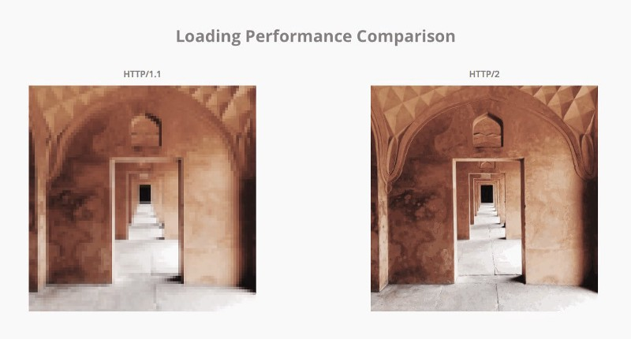
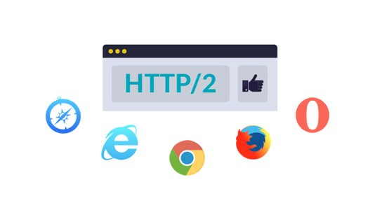
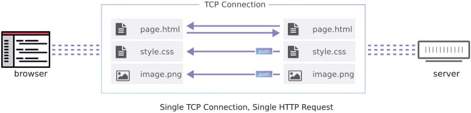
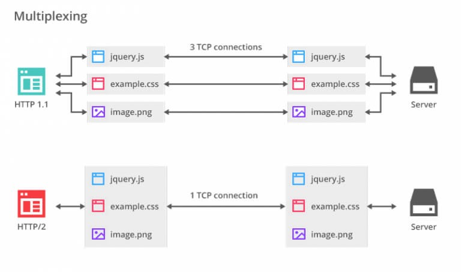
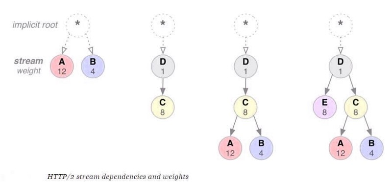

原文地址：[How Evolution Of HTTP/2 From HTTP/1 Changed The Web](https://medium.com/@sarahelson81/how-evolution-of-http-2-from-http-1-changed-the-web-889bee4b0768)

作者：Sarah Elson

## 前言
有没有遇到过这样的情况：你真的需要快速打开一个网页，而且由于网速较慢，它会一直持续下去？可能是你的网络中有人正在下载一个阻塞带宽的资源？

这很刺激，不是吗？

在这个 5G 时代，缓慢的页面加载速度对于用户和开发人员来说都是无缝用户体验的祸害。我们无法控制用户的互联网速度，但作为开发人员，我们可以确保我们尝试了本书中的每一个技巧，使用户的网络旅程尽可能顺利。

这就是 HTTP 协议来拯救的地方。

## 什么是 HTTP？
**HTTP（超文本传输​​协议）** 可帮助我们获得流畅的互联网体验。它于 1996 年首次推出。它是协作、分布式和超媒体信息系统的应用层协议，作为万维网数据通信的基础。HTTP 旨在用于 Web 浏览器和 Web 服务器之间的通信，以及它充当客户端和服务器之间的桥梁。

基本上，它用于传输超媒体文件，如 HTML。HTTP 由 URL 和超文本构成。它是客户端 - 服务器计算系统中的请求 - 响应协议。HTTP / 1.1（通用 HTTP 的版本）的第一个定义发生在 1997 年。

## HTTP / 1.1 中的限制
HTTP / 1.1，更新到 HTTP 1，在 1999 年被标准化. HTTP / 1.1 帮助人们在线运行他们的业务，但 HTTP / 1.1 中有一些限制，然后在 V2 中进行了更新。

- 加载网页时出现延迟
- 线路头部阻塞问题
- 通过单个 TCP 连接复用多个请求
- 每个资源文件的不同资源请求
- HTTP 标头很长，导致网页加载延迟
- 当时的网络非常不同，网页越慢，互联网连接越慢。但多年来，我们使用网络的方式 - 发生了显着变化，网站现在比以前复杂得多。

HTTP 的重大更新于 2015 年推出，作为解决 HTTP / 1.1 中面临的问题的 HTTP / 2。
HTTP / 2 源自 Google 开发的早期实验性 SPDY 协议。它使 Web 应用程序更快，更简单，更强大。

## 如何切换到 HTTP / 2
HTTP / 2 与 HTTP / 1.1 向后兼容。但是，您需要执行以下操作切换到 HTTP / 2：

- 采用 HTTPS 并获得 TLS 证书
- 使用 image Sprites 而不是多个文件
- 连接 JavaScript 和 CSS 文件
- 域分片

## HTTP / 2 如何解决 HTTP / 1.1 的限制
HTTP / 2 侧重于 HTTP / 1.1 中关注的具体目标和问题：

- 创建客户端和服务器时允许选择使用 HTTP 1.1 或 2.0 的算法
- 使用 HTTP / 1.1 保持对方法，状态码，URI 和头字段的高度兼容性
- 减少延迟以提高网页加载速度
- 支持常见的 HTTP 使用案例，如桌面 Web 浏览器，移动 Web 浏览器，Web API，各种规模的 Web 服务器，代理服务器，反向代理服务器，防火墙和内容交付网络。

## 哪些浏览器支持 HTTP / 2？
大多数浏览器现在支持 HTTP / 2。浏览器列表包括最新版本的 Chrome，Firefox，Safari，Internet Explorer，Opera 等。您可以使用 [Akamai 的工具](https://http2.akamai.com/demo) 来检查您的浏览器是否支持 HTTP / 2。

## HTTP / 2 如何帮助提高网页加载速度

### 头部压缩
`header` 字段在请求或响应后发送。`HTTP / 1.1` 请求和响应不会以纯文本压缩和传输，从而导致大量不必要的字节被下载。

但在 `HTTP / 2` 中，`header` 字段被压缩并以二进制代码传输，使得用户计算机更加紧凑和高效地加载。

`header` 压缩可降低客户端请求的开销，从而降低带宽并缩短页面加载时间。

### 服务端推送
在 `HTTP / 1.1` 中，当浏览器连接到请求网页的 Web 服务器时，首先发送 HTML 文件，然后浏览器请求其他资源文件（如 CSS，JavaScript 等）。但在 `HTTP2` 服务器推送中，除了响应原始请求以外，服务器还可以向单个客户端请求发送多个响应，而无需客户端明确请求每个响应。

如果您曾经使用过内联 CSS，JavaScript 或任何其他源文件等通过 url 请求文件资源的方式，那么您已经体验过服务器推送。通过手动将源文件添加到 URI 中，我们将该源文件推送到客户端，而无需等待客户端请求。我们可以通过 HTTP / 2 获得相同的结果并获得额外的性能优势。

### 通过单个 TCP 连接复用多个请求
`HTTP / 1.1` 的一个限制是它只能在一个连接上逐一请求文件 - 这意味着 ` 请求文件 `、` 等待响应 `、` 下载文件 `，然后 ` 请求下一个文件 `。这会产生 `header 阻塞 ` 和 ` 低效使用底层 TCP 连接 ` 的问题。

HTTP / 2 中新的二进制框架层消除了这些限制，并且通过允许客户端和服务器将 HTTP 消息分解为独立的帧，交织它们，然后在另一端重新组装它们，从而消除了这些限制并实现了完整的请求和响应复用。

### 流优先级
一旦 HTTP 消息可以分成许多单独的帧，HTTP / 2 允许多路复用来自多个流的帧。客户端和服务器交叉并交付帧的方式成为关键的性能问题。为了执行此操作，HTTP / 2 标准将权重和依赖关系与每个流相关联。

- 每个流可以被分配 1 到 256 之间的整数权重。
- 每个流可以被明确地依赖于另一个流。

` 流依赖性 ` 和 ` 权重的组合 ` 允许客户端构建并传送 ` 优先化树 `，表示它更愿意接收响应。反过来，服务器可以使用这些信息通过控制 CPU，内存和其他资源的分配来优先化流处理，并且一旦响应数据可用，分配带宽以确保向客户端最优地传送高优先级响应。

## HTTP / 2 的优点
切换到 HTTP / 2 的好处是立竿见影的。大多数用户正在使用可以利用协议的浏览器，每天的数字都在上升。

- 更多屏蔽：默认情况下，HTTP / 2 始终具有加密功能，这可以在各个站点之间实现高度安全性。
- 手机友好：所有的移动网站都被允许提供大量请求，以防止下载头中的数据字节是头压缩功能的结果。
- 更快的页面加载时间：在消除了协议的许多障碍之后，HTTP / 2 承诺会比当前的标准更快。
- 与 HTTP / 1.1 的兼容性： HTTP / 2 与 HTTP / 1.1 兼容。为确保切换到新协议的过程尽可能顺利，方法，状态码，头字段和 URI 与 HTTP / 1.1 中保持相同。
- 减少对备选方案的依赖性：` 多路复用 ` 功能解决了耗费时间的方法来减少来自服务器的请求数量的问题 - 例如域分片，`image Sprites` 或 ` 内嵌 Javascript 和 CSS` - 并不是必不可少的。
## HTTP / 2 的缺点
在转向新协议之前，企业应该考虑到一些限制。

- 照顾观众：尽管大多数用户使用可以利用协议的浏览器，但也有一些人继续使用旧版浏览器，但浏览器却没有。除此之外，并非所有的 Web 服务器都支持 HTTP / 2。所以当前的页面加载速度优化过程仍然是必要的。
- HTTPS 要求：对于不使用 HTTPS 的站点，从 HTTP / 1.1 移动将变得更加困难，因为 HTTP / 2 具有站点已在 HTTPS 上的先决条件。因此，将网站切换到 HTTPS 需要将所有 HTTP URL 转换为 HTTPS。由于迁移到 HTTPS 对搜索引擎是一个积极因素，因此，升级您的网站会很好。
- 页面加载性能可能最低：从 HTTP / 1.1 切换到 HTTP / 2 可能需要大量时间和资源，因此确保对网站速度的影响值得。如果某个网站已针对页面加载速度进行了优化，则性能改进可能会比预期的要小。
- HTTP / 2 未知事实： HTTP 仍然是新的，因此需要进行大量研究以确定最佳实践和可能的缺点。