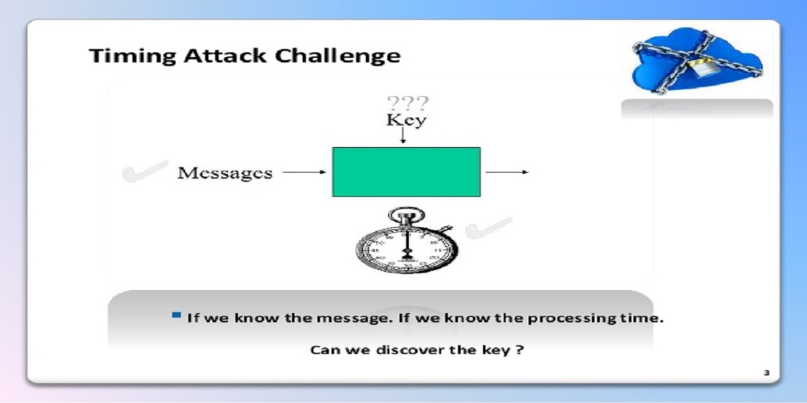

## 前言
假如你在项目中遇到过 eslint 报错 <span style="color: red;">Potential timing attack</span> ，不可忽视！这是一个涉及到安全的问题：时序攻击。
## eslint 报错原因
* 首先`eslint`引入了一个叫做`eslint-plugin-security`的插件，这个插件有助于识别出潜在的安全问题，但同时也会产生误报的问题，附上插件 [源码地址](https://github.com/nodesecurity/eslint-plugin-security/blob/master/rules/detect-possible-timing-attacks.js)。

``` js
  var keywords = '((' + [
    'password',
    'secret',
    'api',
    'apiKey',
    'token',
    'auth',
    'pass',
    'hash'
  ].join(')|(') + '))';

  var re = new RegExp('^' + keywords + '$', 'im');

  function containsKeyword (node) {
    if (node.type === 'Identifier') {
      if (re.test(node.name)) return true;
    }
    return
  }


  if (node.test.operator === '==' || node.test.operator === '===' || node.test.operator === '!=' || node.test.operator === '!==') {
    // 在这里 console 出错误
  }
```
首先这个插件会判断本次的运算符是否为 `==、===、！=、！==`其中一种，其次检查标识符（字段名）是否包含特殊字符串`password、secret、api、apiKey、token、auth、pass、hash`，如果同时满足二者情况，eslint 就会编译报错 <span style="color: red;">Potential timing attack</span>。

## 攻击定义
`timing attack`：时序攻击，属于侧信道攻击 / 旁路攻击，侧信道攻击指的是利用信道外的信息，比如加解密的数据、数据比较时间、密文传输的流量和途径进行攻击的方式，相当于是“旁敲侧击”。

### 攻击点
* 首先讲讲`js`比较两个字符串大小的原理：
  - 判断字符串长度是否为`0`，如果为`0`，就可以直接比较出结果；反之，进入到第二步。
  - 字符串是由一个个字符组成，通过每个字符的`charCode`进行比较。
  - 在第二步中，只要出现一个字符不同，就 `return false`，剩余的字符不再做比较。

* 单个字符的比较是很快的，攻击者可以细化测量时间精度到微秒，通过响应时间的差异推算出是从哪一个字符开始不用的，这样一次次实验或者用 Python 写个脚本去跑，就可以试出正确的密码，密码破解的难度也降低了不少。

#### 容易受攻击的写法
``` js
  if (user.password === password) {
    return { state: true }; // 登录成功
  }
```

### 防御措施
每次不同的输入会造成处理时间的不同。为了防止它，我们需要使字符串比较花费相同的时间量，无论输入的密码是什么。

#### 不容易受攻击的写法
系统中每一个密码的长度是固定的，每次比较密码是否相同时，使用正确密码的长度作为比较次数，使用异或比较每一个字符的 Unicode 编码是否相等，并且把每一次的比较结果存放到一个数组中，最后再判断数组的每一个元素是否为`0（为 0 表示两个字符相同）`。
``` js
  // psdReceived 为用户输入密码；
  // psdDb 为系统中存储的正确用户密码
  const correctUser = (psdDb, psdReceived) => {
    const state = [];
    for (let i = 0; i < psdDb.length; ++i) {
      if (!psdReceived[i]) {
        state.push(false);
      } else {
        state.push(psdReceived.charCodeAt(i) ^ psdDb.charCodeAt(i));
      }
    }
    return state.length !== 0 && state.every(item => !item);
  }
```

#### 三方包推荐
也可以使用 [cryptiles](https://github.com/hapijs/cryptiles) 这个 npm 模块来解决这个问题
``` js
import cryptiles from 'cryptiles';

......
return cryptiles.fixedTimeCimparison(passwordFromDb, passwordReceived);