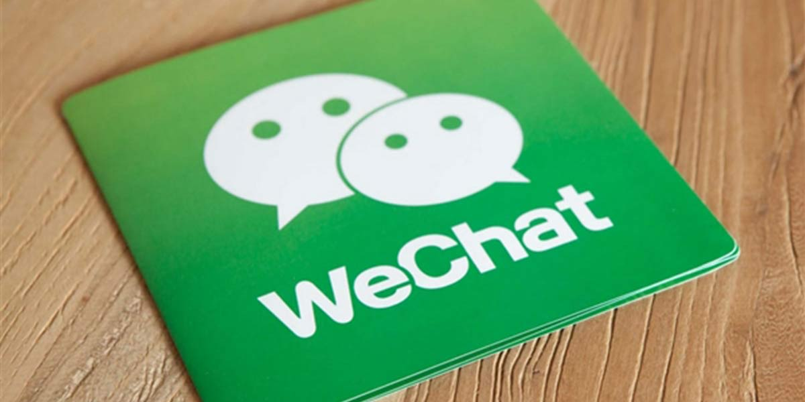

## 励志前言

>天天用公众号，何尝不去搞定微信公众号开发，用用自己的，岂不乐呼呼

## 概述

* 微信公众平台开发是指为微信公众号进行业务开发，包括移动端、PC端的开发，可前往微信开放平台接入。

* 微信公众平台提供的服务接口都具有调用次数限制，所以推荐先申请一个`测试账号`，进行基于测试接口的开发。

* 微信公众平台的接口调用需要传入`access_token`作为凭证，且`access_token`的有效时间为`2h`，且获取`access_token`的次数有限，推荐将有效的`access_token`存储到本地(global对象的某个字段)，待过期则重新获取。

* 公众号平台接口的调用仅支持`80(http)`和`443(https)`端口，所以需要`本地server`运行在任意其中一个端口上。

## 接入指南

#### 填写服务器配置
  * 开发者需要前往微信公众号平台官网，在`测试号管理-基本设置`页面，填写`URL`、`Token`，记录下测试号`appID`、`appsecret`。

  * 开发者提交了接口配置信息之后，微信服务器将会往填写的URL发送`GET请求`，验证消息的确来自微信服务器，验证成功则可以调用微信服务器的其他api接口，反之则接入微信服务器失败。

#### 实现业务逻辑
  * 在上一步中，验证URL有效成功后即可调用微信服务器提供的其他接口，当然不同的微信账号具有不同的接口权限，可在公众平台上进行申请。

  * 微信公众号的所有接口数据将会通过`POST请求`发往`本地server`，开发者可将部分有用信息存储下来，同时可以做相应的业务处理。

  * 本地server可将之前存储的信息进行筛选同时加上其他自定义的数据，调用微信公众号提供的接口，最后将会在微信上得到响应。

## 接口实现

  #### 验证消息来自微信服务器
  
  * 开发者通过检验signature对请求进行校验（下面有校验方式）。若确认此次GET请求来自微信服务器，原样返回echostr参数内容，则接入生效，成为开发者成功，否则接入失败。
    ```js
    route.js

    {
      method: 'get',
      path: '/api/wechat/mainEntry',
      config: {
        auth: false,
        tags: ['api', 'wechatApi'],
        description: '验证消息来自微信',
        handler: controller.wechatAuth,
      },
    }
    ```
    ```js
    controller.js

    export const wechatAuth = (request, reply) => {
    /**
     * signature 微信加密签名
    * timestamp 时间戳
    * nonce 随机数
    * echostr 随机字符串
    */
    const {
      signature, timestamp, nonce, echostr,
    } = request.query;
    // 2.将token、timestamp、nonce三个参数进行字典序排序
    const array = [Config.get('wechatServer.token'), timestamp, nonce];
    array.sort();

    // 3.将三个参数字符串拼接成一个字符串进行sha1加密
    const tempStr = array.join('');
    const hashCode = crypto.createHash('sha1'); // 创建加密类型
    const resultCode = hashCode.update(tempStr, 'utf8').digest('hex'); // 对传入的字符串进行加密

    // 4.开发者获得加密后的字符串可与signature对比，标识该请求来源于微信
    console.log(resultCode === signature, '+++++++++++++++');
    if (resultCode === signature) {
      return reply(echostr);
    }
    return reply(false);
    };
    ```

  #### 微信服务器与本地服务器的唯一通信接口

  * 在上一步验证成功之后，该微信公众号的所有数据将以`POST请求`的形式发往本地server，可以认为这个接口是本地服务器开放给微信服务器的唯一入口
    ```js
    route.js

    {
      method: 'post',
      path: '/api/wechat/mainEntry',
      config: {
        auth: false,
        pre: [
          {
            method: (request, reply) => {
              xml2js.parseString(
                request.payload,
                { explicitArray: false },
                  err, json) => reply(json),
              );
            },
            assign: 'toXML',
          },
        ],
        tags: ['api', 'wechatApi'],
        description: '通过此接口可以得到微信发送的所有消息',
        handler: { async: controller.userBind },
      },
    },
    ```
    ```js
    controller.js

    /**
     * 将数据转换成微信接口指定的数据格式
    * @param {*} data
    */
    const toXML = (data) => {
      const msg = `<xml>
        <ToUserName><![CDATA[${data.ToUserName}]]></ToUserName>
        <FromUserName><![CDATA[${data.FromUserName}]]></FromUserName>
        <CreateTime>${data.backTime}</CreateTime>
        <MsgType><![CDATA[text]]></MsgType>
        <Content><![CDATA[${data.Content}]]></Content>
        </xml>`;
      return msg;
    };
    const xmlRes = toXML({
      ToUserName: FromUserName,
      FromUserName: ToUserName,
      Content: '服务绑定成功',
    });
    reply(xmlRes).header('Content-Type', 'application/xml');
    ```

  * 由于公众平台提供的接口发送的数据为`xml`格式，不是常用的`application/json`格式，所以需要在服务端对`request`进行`预处理`。

  * 响应公众平台的调用也需要将数据处理成`xml`格式。

  #### 注意
  * 以上两个路由为`微信后台服务`与`本地server`通信的`必要条件`，且`必须同名`，一个`GET路由`，一个`POST路由`。

  * GET路由用于`验证消息来自微信服务器`，决定接入是否生效，POST路由用去`接收微信后台的数据请求并响应`，同时可做相应逻辑处理。

## 地址映射
  由于开发阶段的服务是运行在本地，微信服务器无法访问本地服务，所以需要做一个`内网穿透`，推荐使用`ngwork`，该工具会自动生成一个临时的`http`或`https`URL，同时与指定的端口服务做映射，最后再在`测试号管理-基本设置`页面的`URL`字段填写临时生成的URL。

## 结言

完成以上步骤，就可以愉快的使用微信后台提供的其他服务，包括模版信息、微信二维码...
